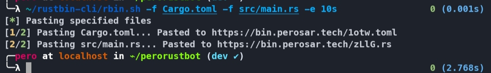

# rustbin-cli

## How to use

### Upload paste(s)
```bash
$ ./rbin.sh -f hello.txt -f bye.txt
```

### Delete paste(s)
```bash
$ ./rbin.sh -d aBcD.sh
```

### Shorten URL(s)
```bash
$ ./rbin.sh -s https://google.com
```

### Set expire time
```bash
$ ./rbin.sh -f hello.txt -f bye.txt -e 30s # This paste will self-destruct in 30 seconds
```

### Configure
```bash
$ ./rbin.sh -c
```

Execute `./rbin.sh` without any arguments for a detailed help menu.

## Screenshots

